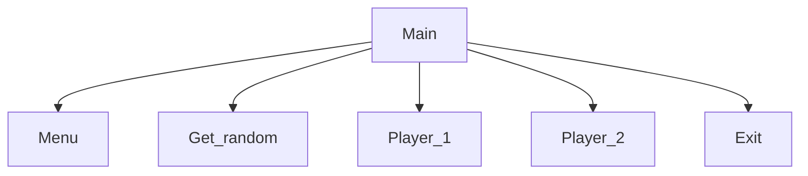

# Number Guessing Game
Oliver, Bricen

## <Number Guessing Game> Description
Takes two inputs for names and the generates a random number between in a range specified by the user

### <Number Guessing Game> Flowchart

#### Function Diagrams

| `Menu`    |               |  Oliver     |
| ------------------ | ------------- | ------------ |
| `argument:type`    | takes input from the user for 1, 2, or 3  |              |
| `time:integer`     | runs program  | outputs feedback, winner and turns             |
| `name:string`      | takes input for name none | returns total |
***
| `Get_Random`    |               |     Bricen   |
| ------------------ | ------------- | ------------ |
| `argument:type`    | takes input from the user for the range  |              |
| `time:integer`     | calculates a random integer in range  | outputs the random number        |
| `name:string`      | takes input for name range | returns the random number |
***
| `Player_1`    |               |     Bricen   |
| ------------------ | ------------- | ------------ |
| `argument:type`    | takes input from the user for the name  |              |
| `time:integer`     | calculates nothing  | outputs the name        |
| `name:string`      | takes input for nothing | returns player ones name |
***
| `Player_2`    |               |     Bricen   |
| ------------------ | ------------- | ------------ |
| `argument:type`    | takes input from the user for the name  |              |
| `time:integer`     | calculates nothing  | outputs the name        |
| `name:string`      | takes input for nothing | returns player twos name |
***
| `Exit`    |               |     Bricen   |
| ------------------ | ------------- | ------------ |
| `argument:type`    | takes input from the user to end the game |              |
| `time:integer`     | calculates nothing  | outputs nothing        |
| `name:string`      | takes input for nothing | returns nothing |
***
