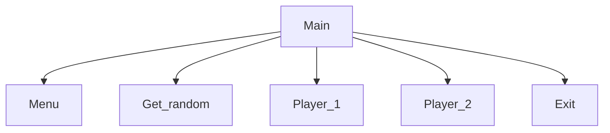

# Number Guessing Game
Oliver, Bricen

## <Number Guessing Game> Description
Takes two inputs for names and the generates a random number between in a range specified by the user

### <Number Guessing Game> Flowchart

#### Function Diagrams

| `Menu`    |               |  Oliver     |
| ------------------ | ------------- | ------------ |
| `argument:type`    | takes input from the user for ____  |              |
| `time:integer`     | calculates ______  | outputs ____             |
| `name:string`      | takes input for name ___ | returns total |
***
| `function name2`    |               |     author   |
| ------------------ | ------------- | ------------ |
| `argument:type`    | takes input from the user for ____  |              |
| `time:integer`     | calculates ______  | outputs ____             |
| `name:string`      | takes input for name ___ | returns total |
***
